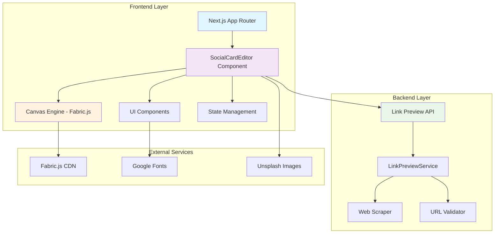
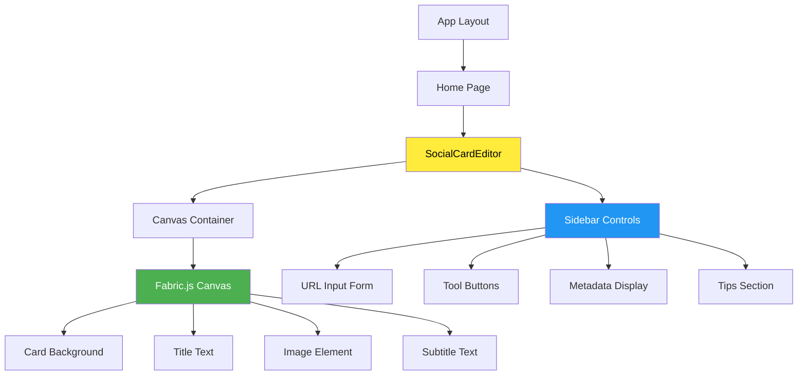
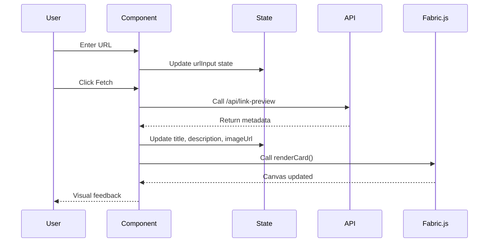
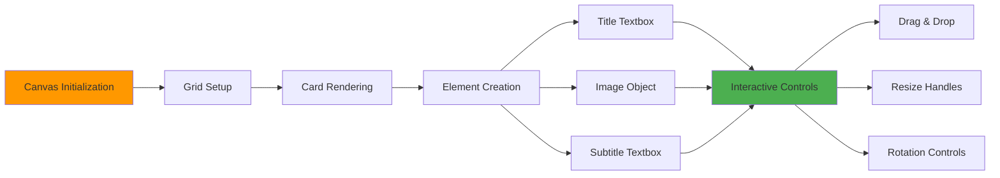
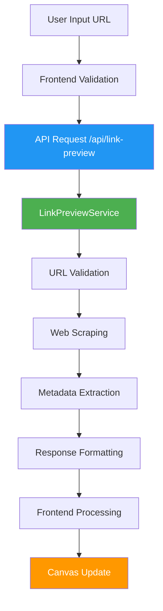
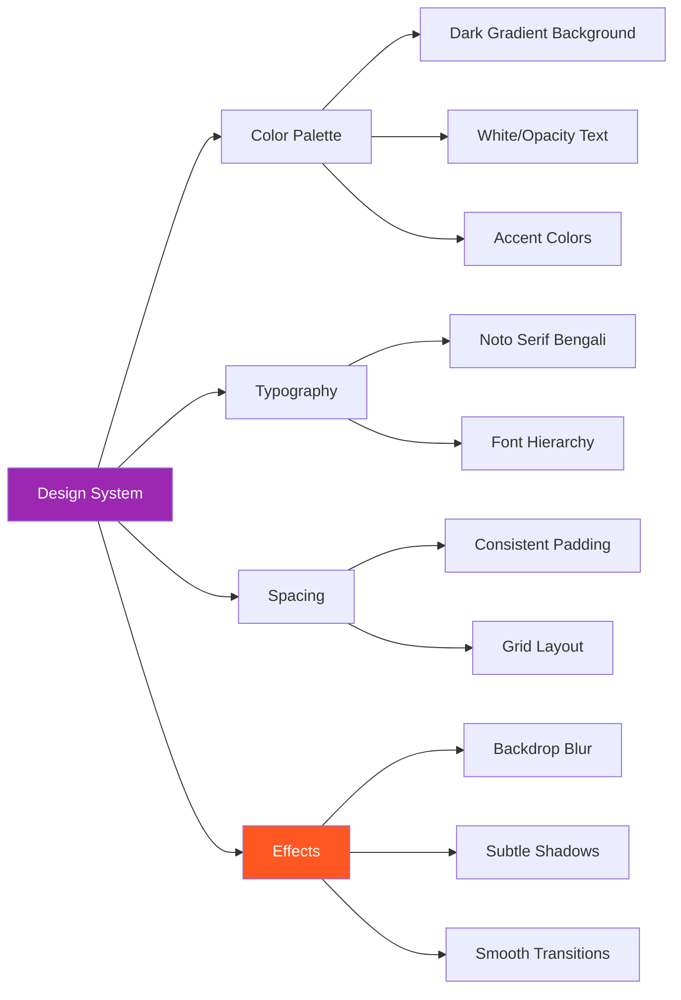
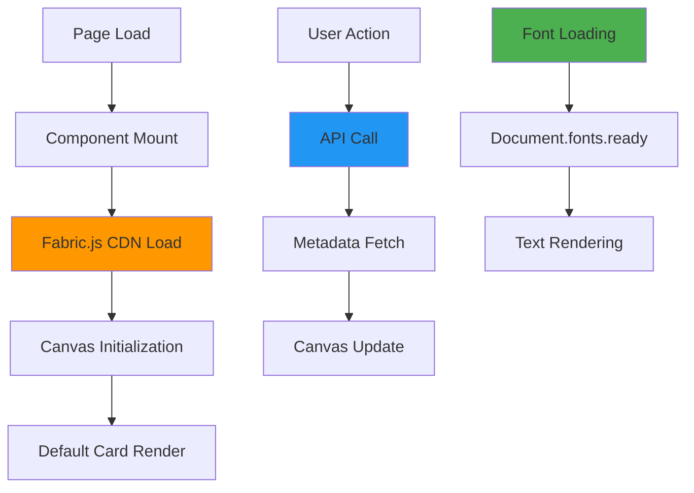
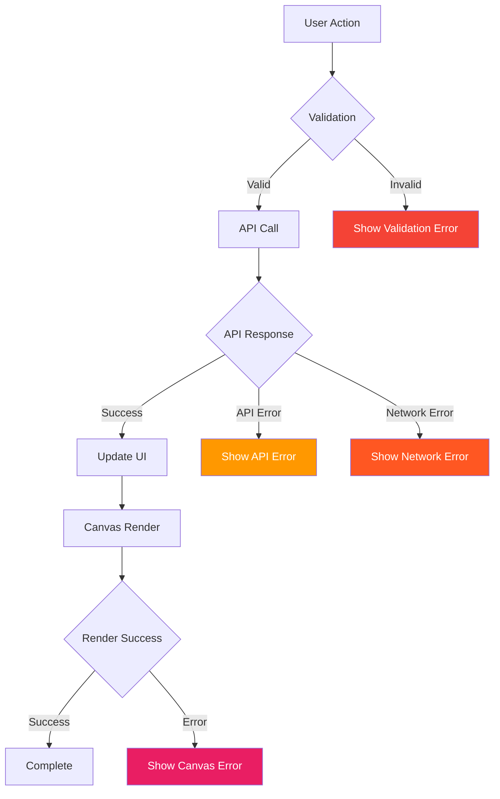

# Social Card Editor - Frontend Architecture Documentation

## Table of Contents
1. [Overview](#overview)
2. [System Architecture](#system-architecture)
3. [Component Structure](#component-structure)
4. [Data Flow](#data-flow)
5. [Canvas Implementation](#canvas-implementation)
6. [API Integration](#api-integration)
7. [UI/UX Design System](#uiux-design-system)
8. [Performance Optimizations](#performance-optimizations)
9. [Development Guidelines](#development-guidelines)

---

## Overview

The Social Card Editor is a modern web application built with **Next.js 14**, **TypeScript**, and **Fabric.js** that allows users to create, customize, and export social media cards. The application features a glassmorphic design system and provides real-time editing capabilities with URL metadata fetching.

### Key Features
- 🎨 **Visual Canvas Editor** - Drag, resize, rotate text and images
- 🔗 **URL Metadata Fetching** - Automatic extraction of title, description, and images
- 🎭 **Glassmorphic UI** - Modern, clean design with backdrop blur effects
- 📱 **Responsive Design** - Works seamlessly across devices
- 💾 **Export Functionality** - Download cards as high-resolution PNG files
- 🌐 **Bengali Font Support** - Proper rendering of Bengali text

---

## System Architecture



### Technology Stack

| Layer | Technology | Purpose |
|-------|------------|---------|
| **Framework** | Next.js 14 | React framework with App Router |
| **Language** | TypeScript | Type safety and developer experience |
| **Canvas** | Fabric.js 5.3.0 | Interactive canvas manipulation |
| **Styling** | Tailwind CSS | Utility-first CSS framework |
| **Fonts** | Google Fonts | Typography (Noto Serif Bengali) |
| **State** | React Hooks | Local component state management |

---

## Component Structure

```
src/
├── app/
│   ├── layout.tsx              # Root layout with font configuration
│   ├── page.tsx                # Main page component
│   └── globals.css             # Global styles and glassmorphic utilities
├── components/
│   └── SocialCardEditor.tsx    # Main editor component
├── services/
│   └── linkPreviewService.ts   # API service layer
├── types/
│   └── api.ts                  # TypeScript interfaces
└── utils/
    └── urlUtils.ts             # URL validation utilities
```

### Component Hierarchy



---

## Data Flow

### State Management Architecture



### Component State Structure

```typescript
interface ComponentState {
  // Form inputs
  urlInput: string;
  isLoading: boolean;
  
  // Fetched metadata
  title: string;
  description: string;
  imageUrl: string;
  ogData: LinkPreviewResponse | null;
  
  // Canvas references
  canvasRef: RefObject<HTMLCanvasElement>;
  fabricCanvasRef: RefObject<FabricCanvas>;
}
```

---

## Canvas Implementation

### Fabric.js Integration

The canvas implementation uses Fabric.js for interactive element manipulation:



### Canvas Architecture

```typescript
// Canvas initialization flow
const initializeCanvas = () => {
  // 1. Create Fabric.js canvas instance
  const canvas = new fabric.Canvas(canvasRef.current, {
    width: 600,
    height: 600,
    backgroundColor: '#2c3e50'
  });
  
  // 2. Add grid lines for visual guidance
  addGridLines(canvas);
  
  // 3. Store canvas reference
  fabricCanvasRef.current = canvas;
};

// Card rendering pipeline
const renderCard = (title: string, imageUrl: string) => {
  // 1. Clear existing content (preserve grid)
  clearSelectableObjects(canvas);
  
  // 2. Create card background (full canvas)
  addCardBackground(canvas);
  
  // 3. Add interactive text elements
  addTitleText(canvas, title);
  addSubtitleText(canvas);
  
  // 4. Load and position image
  addImageElement(canvas, imageUrl);
};
```

### Element Configuration

| Element | Properties | Interactions |
|---------|------------|--------------|
| **Card Background** | `selectable: false` | Static background |
| **Title Text** | `hasControls: true`, `lockRotation: false` | Drag, resize, rotate, edit |
| **Image** | `hasControls: true`, `lockRotation: false` | Drag, resize, rotate |
| **Subtitle** | `hasControls: true`, `lockRotation: false` | Drag, resize, rotate, edit |
| **Grid Lines** | `selectable: false`, `evented: false` | Visual guides only |

---

## API Integration

### Link Preview Service Architecture



### API Response Handling

```typescript
interface LinkPreviewResponse {
  success: boolean;
  url: string;
  metadata: {
    title: string;
    description: string;
    image: string;
    favicon: string;
    url: string;
  } | null;
  error?: string;
  timestamp: string;
}

// Error handling strategy
const fetchOgData = async (url: string) => {
  try {
    const response = await fetch(`/api/link-preview?url=${encodeURIComponent(url)}`);
    const data: LinkPreviewResponse = await response.json();
    
    if (data.success && data.metadata) {
      // Success path: Update state and render
      updateMetadataState(data.metadata);
      renderCard(data.metadata.title, data.metadata.image);
    } else {
      // API error: Show error state
      handleApiError(data.error);
    }
  } catch (error) {
    // Network error: Show fallback
    handleNetworkError(error);
  }
};
```

---

## UI/UX Design System

### Glassmorphic Design Principles



### CSS Architecture

```css
/* Glassmorphic base classes */
.glass-panel {
  backdrop-filter: blur(16px);
  background: rgba(255, 255, 255, 0.05);
  border: 1px solid rgba(255, 255, 255, 0.1);
  border-radius: 1rem;
}

.glass-button {
  backdrop-filter: blur(12px);
  background: rgba(255, 255, 255, 0.1);
  transition: all 0.3s cubic-bezier(0.4, 0, 0.2, 1);
}

.glass-button:hover {
  background: rgba(255, 255, 255, 0.2);
  transform: translateY(-2px);
}
```

### Responsive Design Strategy

| Breakpoint | Layout | Canvas Size | Sidebar |
|------------|--------|-------------|---------|
| **Mobile** | Stacked | 100% width | Full width below |
| **Tablet** | Stacked | Max 600px | Full width below |
| **Desktop** | 2-column | Fixed 600px | Fixed sidebar |

---

## Performance Optimizations

### Loading Strategy



### Optimization Techniques

1. **Lazy Loading**
   - Fabric.js loaded from CDN only when needed
   - Images loaded asynchronously with crossOrigin support

2. **Memory Management**
   - Canvas disposal on component unmount
   - Script cleanup in useEffect return function

3. **Rendering Optimization**
   - Selective object clearing (preserve grid lines)
   - Batch canvas operations with renderAll()

4. **Font Loading**
   - Google Fonts with Next.js optimization
   - Fallback fonts for better loading experience

---

## Development Guidelines

### Code Organization Principles

```typescript
// 1. Separation of Concerns
const SocialCardEditor = () => {
  // State management
  const [state, setState] = useState();
  
  // Canvas operations
  const initializeCanvas = () => { /* ... */ };
  const renderCard = () => { /* ... */ };
  
  // API operations
  const fetchOgData = () => { /* ... */ };
  
  // UI event handlers
  const handleUrlSubmit = () => { /* ... */ };
  
  // Render
  return <UI />;
};
```

### Error Handling Strategy



### Testing Strategy

| Test Type | Coverage | Tools |
|-----------|----------|-------|
| **Unit Tests** | Component logic, utilities | Jest, React Testing Library |
| **Integration Tests** | API integration, canvas operations | Cypress |
| **Visual Tests** | UI components, responsive design | Storybook, Chromatic |
| **E2E Tests** | Complete user workflows | Playwright |

### Deployment Considerations

1. **Build Optimization**
   - Next.js automatic code splitting
   - Image optimization for default assets
   - CSS purging with Tailwind

2. **CDN Strategy**
   - Fabric.js from reliable CDN
   - Google Fonts with preconnect
   - Static assets optimization

3. **Browser Compatibility**
   - Modern browsers (ES2020+)
   - Canvas API support required
   - Backdrop-filter support for glassmorphic effects

---

## Conclusion

This Social Card Editor represents a modern, scalable frontend architecture that balances performance, maintainability, and user experience. The glassmorphic design system provides a contemporary aesthetic while the Fabric.js integration enables powerful canvas manipulation capabilities.

The modular architecture ensures easy maintenance and feature expansion, while the comprehensive error handling and performance optimizations provide a robust user experience across different devices and network conditions.

---

*Last Updated: December 2024*  
*Architecture Version: 1.0*  
*Next.js Version: 14.x*  
*Fabric.js Version: 5.3.0*